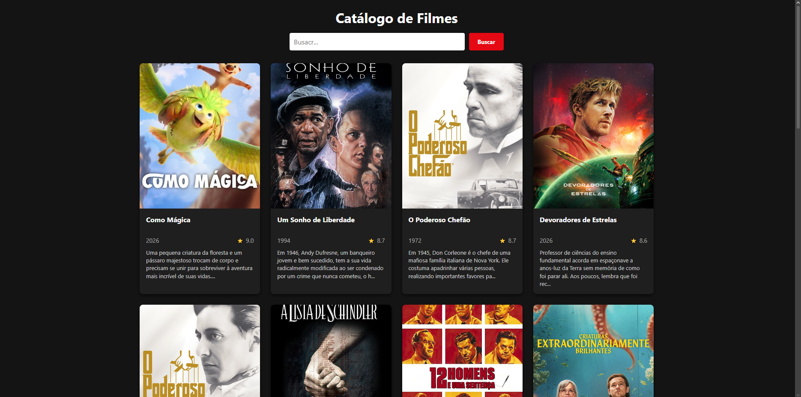
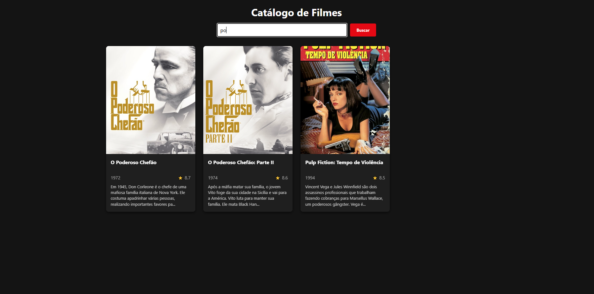

Nome: Sofia Vassallo de Andrade
Matrícula: 927680
Endpoint escolhido: Filmes mais bem avaliados

Fluxo da Aplicação: A Fetch API faz uma requisição assíncrona ao endpoint de filmes mais bem avaliados da TMDB, cujo retorno em JSON é convertido e tratado localmente através de estruturas de repetição e filtros. Por fim, os dados manipulados são injetados dinamicamente no DOM da página, criando os elementos visuais dos cards sem a necessidade de HTML estático.